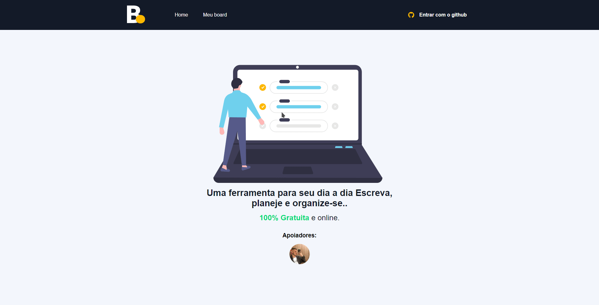

## [NEXTJS] BOARD </h2>

[PT-BR]💻 BoardTask com login via GitHub e pagamento pelo PayPal (projeto desenvolvido ao decorrer do curso do sujeitoprogramador)

<h5>❗ ATENÇÃO: O id do PayPal esta em modo SandBox (somente contas de teste), caso for testar & usar, alterar para seu id no modo live (produção) ❗</h5>

<h3>🚀 Tecnologias utilizadas </h3>
<ul>
  <li> NextJS </li>
  <li> TypeScript </li>
  <li> SASS </li>
  <li> Firebase </li>
</ul>

[ ENG ]💻 Board Task with login via GitHub and payment by PayPal (project developed during the course of the sujeitoprogramador)

<h5>❗ ATTENTION: PayPal id is in SandBox mode (test accounts only), if to test & use, change to your id in live mode (production) ❗</h5>

<h3>🚀 Technologies used </h3>
<ul>
  <li> NextJS </li>
  <li> TypeScript </li>
  <li> SASS </li>
  <li> Firebase </li>
</ul>

<h3>Preview:</h3>

  <h3>⚙️🔥 Firebase config</h3>
   <table>
    <tr>
      <th colspan="3">USERS</th>
    </tr>
    <tr>
      <td>donate: boolean</td>
      <td>image:  string </td>
      <td>lastDonate: timestamp	</td>
    <tr>
  </table>

